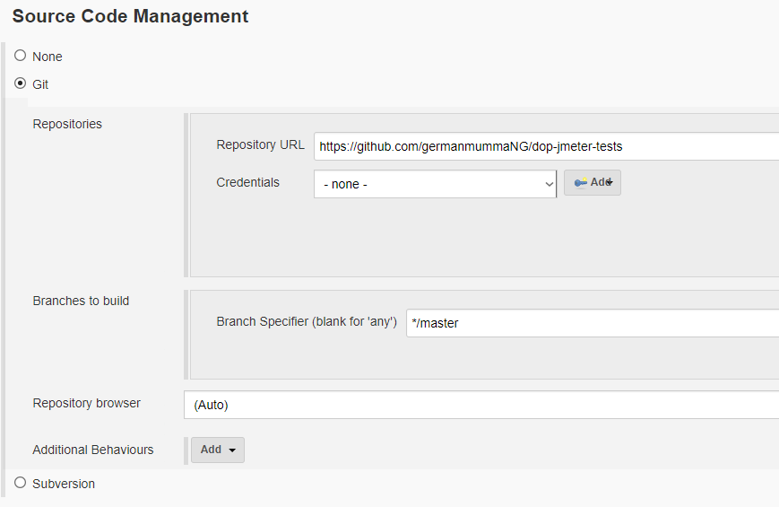
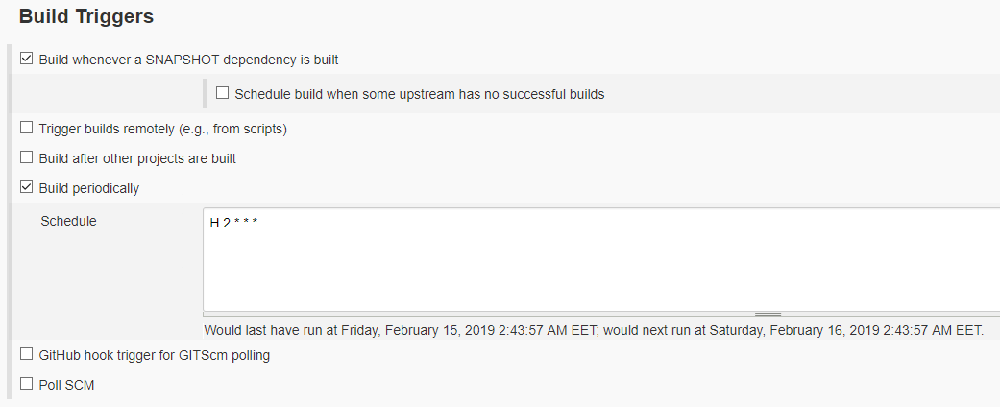
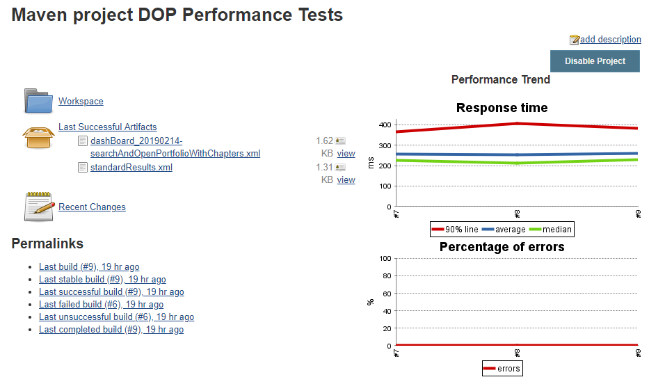

# Performance Test Project using Apache JMeter and Maven
An example project to showcase how to setup, run and view results of 
Apache JMeter performance tests. Project uses **jmeter-maven-plugin**, you can find documentation, 
examples etc on the [project's GitHub](https://github.com/jmeter-maven-plugin/jmeter-maven-plugin/wiki).

## Getting Started
Specify required performance test attributes in the POM.xml properties section:
* threadCount: how many users will be creating the load
* rampupInSeconds: how in how many seconds the required number of users (threadCount) will be reached
* durationInSeconds: how long the test will be carried out.
For more info on how JMeter tests are setup please refer to JMeter learning materials 
under Prerequisites.

### Running tests locally
Navigate to the root of the project and run ``mvn clean verify``. Running this command first time will 
download and install all required dependencies as well.

### Prerequisites
1. [Install and setup Maven on Windows](https://www.mkyong.com/maven/how-to-install-maven-in-windows/)
2. [Install and setup Maven on Linux](https://www.javahelps.com/2017/10/install-apache-maven-on-linux.html)
3. Learn how to write test plans in JMeter: [BlazeMeter JMeter Academy: Introduction to JMeter](https://academy.blazemeter.com)
4. Learn how to analyze JMeter results: [JMeter Results Analysis: The Ultimate Guide](https://octoperf.com/blog/2017/10/19/how-to-analyze-jmeter-results/)
5. Read about cron jobs: [A Beginners Guide to Cron Jobs](https://www.ostechnix.com/a-beginners-guide-to-cron-jobs/) 

## Running tests in Jenkins
For Continuous Testing you should setup a build in CI system. For Jenkins, follow the instructions below:
1. Select New Item
2. Enter a project name and select Maven project (might need to install the plugin if this option is missing)
3. **Source Code Management** setup

4. **Build Triggers** setup to run tests every day at *somewhere around 2 AM* ([here's why](https://stackoverflow.com/questions/26383778/spread-load-evenly-by-using-h-rather-than-5)).

5. **Build** setup

6. Press Add post-build action
7. **Post-build Actions** setup for performance report generation

8. Save

The setup is complete. Now press **Build Now**. After first run the Performance plugin graphs don't show anything interesting.
This is because it requires at least 2 sets of data, meaning at least 2 build executions. After second run the graphs will show data.

## Running tests in TFS (TODO)

## Author
* German Mumma